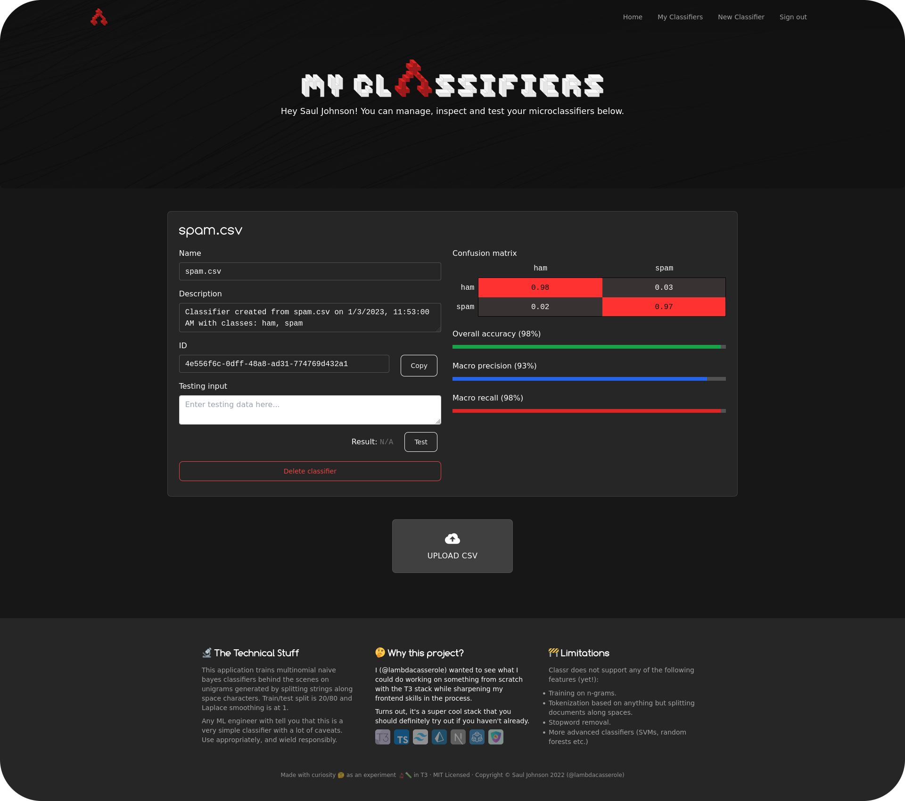

# Classr

Train microclassifiers in the cloud for spam detection, sentiment analysis and more.

## Overview

Classr is a web app that allows users to create *microclassifiers*. A microclassifier is just a machine learning model (classifier) that is trained using a minimal (but still reasonable) amount of training data (4MB max).

Classr uses the [bayes](https://www.npmjs.com/package/bayes) package at its core with custom additions for calculation of precision/recall/F1 score etc. and generation and rendering of confusion matrices.

## Why this project?

I wanted to see what I couuld do working on something from scratch with the T3 stack while sharpening my frontend skills in the process.

Turns out, it's a super cool stack that you should definitely try out if you haven't already!

* [create-t3-app](https://create.t3.gg/)
* [TypeScript](https://typescriptlang.org)
* [Next.js](https://nextjs.org)
* [NextAuth.js](https://next-auth.js.org)
* [Prisma](https://prisma.io)
* [Tailwind CSS](https://tailwindcss.com)
* [tRPC](https://trpc.io)

## Limitations

Classr trains multinomial naive bayes classifiers behind the scenes on unigrams generated by splitting strings along space characters. Train/test split is 20/80 and Laplace smoothing is at 1.

**Any ML engineer with tell you that this is a very simple classifier with a lot of caveats. Use appropriately, and wield responsibly.**

Classr does not support any of the following features (yet!):

* Training on n-grams.
* Tokenization based on anything but splitting documents along spaces.
* Stopword removal.
* More advanced classifiers (SVMs, random forests etc.)

## Deployment

This app is designed for deployment on [Vercel](https://create.t3.gg/en/deployment/vercel) but you might also be able to get it to work with [Docker](https://create.t3.gg/en/deployment/docker) (I haven't tried this myself yet).
